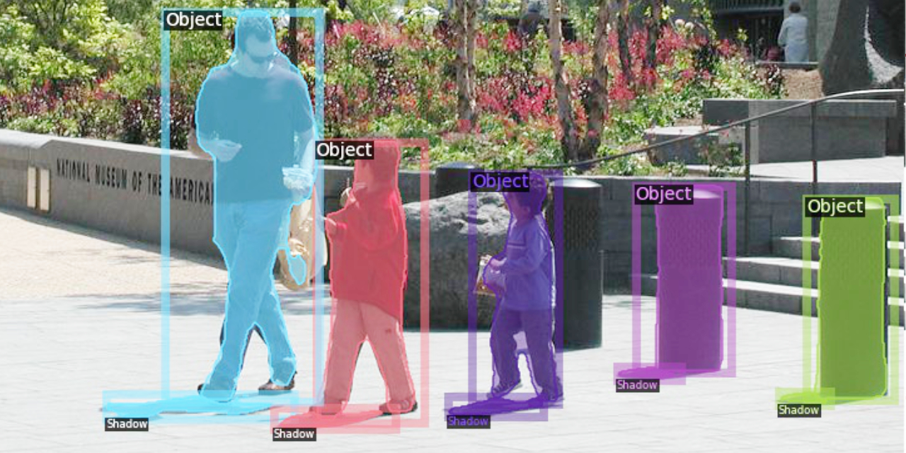

# Instance Shadow Detection (CVPR’ 20)

[Tianyu Wang](https://stevewongv.github.io)\*, [Xiaowei Hu](https://xw-hu.github.io)\*, Qiong Wang,  Pheng-Ann Heng,  and [Chi-Wing Fu](http://www.cse.cuhk.edu.hk/~cwfu/)
 (\* Joint first authors.)

[[`openaccess`](http://openaccess.thecvf.com/content_CVPR_2020/papers/Wang_Instance_Shadow_Detection_CVPR_2020_paper.pdf)][[`arXiv`](https://arxiv.org/abs/1911.07034)] [[`BibTeX`](#CitingLISA)]




Instance shadow detection aims to find shadow instances paired with object instances. We present a dataset, a deep framework, and an evaluation metric to approach this new task. This repo is implemented on [Detectron2](https://github.com/facebookresearch/detectron2).


## Installation 

Install LISA and pysobatools

```bash
$ cd InstanceShadowDetection
$ python setup.py install
$ cd PythonAPI
$ python setup.py install
```

## Docker

```bash
$ cd InstanceShadowDetection/docker

$ docker build --network=host --tag="instanceshadow" -f ./Dockerfile .

$ docker run --gpus all -it --ipc=host --name=instanceshadow --network=host -v /YOURPATH:/data instanceshadow:latest
```

**(Nvidia-docker)[https://github.com/NVIDIA/nvidia-docker] is needed.**

## Model, dataset and our results

Please dowload from [Google Drive](https://drive.google.com/drive/folders/1MKxyq3R6AUeyLai9i9XWzG2C_n5f0ppP). Put the model in `projects/LISA/output_light/`. 

## Demo

```bash
$ cd projects/LISA/
$ python demo.py --input ./demo/web-shadow0573.jpg --output ./ --config ./config/LISA_101_FPN_3x_demo.yaml
```

## Train

```bash
$ python train_net.py --num-gpus 2 --config-file ./config/LISA_101_FPN_3x.yaml

```
## Evaluation

```bash
$ python train_net.py --num-gpus 2 --config-file ./config/LISA_101_FPN_3x.yaml --eval-only --resume
$ python SOAP.py
```

## Visualize
```bash
python visualize_json_results.py --ins_input ./output_light/inference/soba_instances_results.json --ass_input ./output_light/inference/soba_association_results.json --output ./output_light/results --dataset soba_cast_shadow_val_full
```
## <a name="CitingLISA"></a> Citation
If you use LISA, SOBA, or SOAP, please use the following BibTeX entry.

```
@InProceedings{Wang_2020_CVPR,
author = {Wang, Tianyu and Hu, Xiaowei and Wang, Qiong and Heng, Pheng-Ann and Fu, Chi-Wing},
title = {Instance Shadow Detection},
booktitle = {IEEE/CVF Conference on Computer Vision and Pattern Recognition (CVPR)},
month = {June},
year = {2020}
}
```
